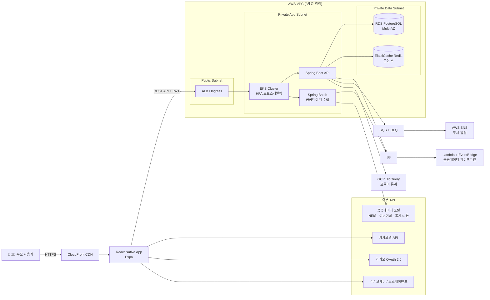

<div align="center">


<br><br>

# 🧸 MoMent (모먼트)

### *Mom + Moment — 아이와 함께하는 모든 순간을 위해*

> 저출산 시대 부모의 양육 비용 부담, 돌봄 공백, 정보 탐색 스트레스를 줄이기 위해 교육·돌봄·공공 지원 정보를 AI로 통합 제공하는 양육 부담 완화형 스마트 육아지원 플랫폼

<br>


<br>

🟡 **팀명 : 메가존붙을캠프** &nbsp;|&nbsp; `2026.04.19 – 2026.06.29` 🟡

</div>

---
 
## 👥 팀원

| 역할 | 이름 | 주요 담당 | GitHub |
|------|------|-----------|--------|
| 팀장 / PM | 정아름 | Frontend · Backend · Infra · CI/CD · Monitoring | [@armddi](https://github.com/armddi) |
| 팀원 | 김민지 | Frontend · Backend · Infra · CI/CD · Monitoring | [@cakefeelsgood](https://github.com/cakefeelsgood) |
 
---
 
## 🎯 프로젝트 목표
 
- 저출산 시대 부모가 겪는 **양육 비용 부담, 돌봄 공백, 정보 탐색 피로를 완화**하는 것을 목표로 한다
- 3세~13세 자녀를 둔 부모가 교육·돌봄·공공 지원 서비스를 **한 곳에서 검색·비교·예약**할 수 있도록 한다
- 자녀 프로필 기반 추천 엔진으로 공공·민간·온라인 프로그램과 정부 지원 혜택을 통합 제공하여 **보다 적은 비용으로 효율적인 육아 선택**을 돕는다
- Redis 분산 락 기반 선착순 예약 시스템을 구축하여 입학 시즌 및 모집 시즌의 **트래픽 급증 상황에서도 안정적인 신청 경험**을 제공한다
- 정부·지자체 지원금 및 무료 공공 프로그램을 자동 매칭하여 **부모가 놓치고 있는 양육 지원 자원 접근성**을 높인다
- LLM 기반 요약·비교·리포트를 통해 정보 해석 시간을 줄이고 **부모의 의사결정 부담을 감소**시킨다
---
 
## 🏗️ 시스템 아키텍처
 

 
> 📖 상세 아키텍처는 [Wiki — 시스템 아키텍처](../../wiki/10-시스템-아키텍처) 참조
 
---
 
## 🛠️ 기술 스택
 
| 계층 | 기술 |
|------|------|
| **Frontend** | React Native · Expo · 카카오맵 SDK · 카카오 OAuth 2.0 |
| **Backend** | Spring Boot (Java) · JPA · QueryDSL · Spring Security · Spring Batch |
| **AI / LLM** | OpenAI API (또는 Gemini) · Prompt Engineering · Redis Cache (LLM 응답 캐싱) |
| **Database** | RDS PostgreSQL Multi-AZ · ElastiCache Redis Cluster |
| **Infra** | AWS EKS (HPA) · S3 · Lambda · EventBridge · CloudFront · SQS + DLQ · VPC 3계층 · GCP BigQuery |
| **IaC** | Terraform (S3 Backend + DynamoDB State Lock) |
| **CI/CD** | GitHub Actions · ArgoCD GitOps · ECR |
| **Monitoring** | CloudWatch · Grafana · SNS → Slack · Locust 부하 테스트 |
 
---
 
## ✨ 핵심 기능

### 1️⃣ 자녀 프로필 기반 AI 종합 분석 및 맞춤 추천 엔진
사용자가 자녀 나이, 지역, 예산, 관심 분야, 현재 고민을 입력하면  
시스템은 이를 종합 분석하여 아이에게 적합한 교육·돌봄 프로그램, 정부 지원 혜택, 무료 공공 프로그램을 통합 추천한다.

```
점수 = 거리/지역 적합도 25% + 예산/무료 여부 20% + 연령 적합도 15% + 관심 키워드 15% + 수업 방식 10% + 신청 가능 여부 10% + 후기 만족도 5%
```
 
- 카카오맵 기반 추천 위치 시각화
- 리스트/지도 동시 탐색 지원
- AI 추천 TOP3 우선 노출


### 2️⃣ 정부 지원금·무료 공공서비스 자동 매칭 + AI 양육비 절감 리포트
부모 및 자녀 프로필을 기반으로 정부 지원금, 무료 공공 프로그램, 지역 돌봄 서비스를 자동 매칭한다.

AI 육아 종합 분석 리포트에서는 받을 수 있는 지원 혜택과 신청 가능한 무료 프로그램, 월 예상 절감 가능한 양육비를 한눈에 확인할 수 있다.

LLM은 계산된 데이터를 기반으로 "활용 가능한 지원 경로"와 "예상 양육비 절감 효과"를 자연어로 요약 제공한다.

- 복지로/정부24/지자체 신청 링크 연결
- 무료 프로그램 + 정부지원 통합 매칭
- 월 평균 양육비 절감 효과 시각화


### 3️⃣ 모집중/마감임박 프로그램 선착순 예약·결제 시스템
사용자는 앱 내 모집중 또는 마감 임박 프로그램을 실시간으로 확인하고 즉시 신청할 수 있다.

선착순 프로그램 예약 시 동시 접속으로 인한 정원 초과를 방지하기 위해 Redis 분산 락을 적용하며,  
테스트 결제를 통해 예약 확정까지 앱 내에서 처리한다.

"사용자 신청 → Redis Lock 획득 → 정원 확인 → 예약 생성 → 결제 승인 → 예약 확정"

또한 마감 임박 태그를 통해 부모가 놓치기 쉬운 프로그램 신청 기회를 빠르게 확보할 수 있도록 설계하였다.

- 모집중 프로그램 실시간 노출
- 마감 임박 태그 제공
- 결제 완료 및 신청 완료 즉시 반영


### 4️⃣ 우리 동네 교육 인프라 지도 탐색
카카오맵 기반으로 주변의 교육 프로그램, 돌봄센터, 무료 공공수업을 위치 중심으로 탐색할 수 있다.

부모는 거리, 비용, 추천 적합도를 한눈에 비교하며 지역별 교 인프라를 빠르게 확인할 수 있다.

- 카테고리별 지도 필터
- 거리 · 비용 · 추천도 시각화
- 주변 프로그램 상세 정보 제공


### 5️⃣ AI 알림센터 + 부모 커뮤니티
AI 추천 도착, 정부 지원금 매칭, 모집 마감 임박, 신청 완료 등 주요 교육 활동 알림을 실시간으로 제공한다.

또한 지역·연령별 부모 커뮤니티를 통해 후기와 정보를 공유하며, 커뮤니티 데이터는 추천 품질 향상에도 활용된다.

- 실시간 교육 활동 알림 제공
- 지역·연령별 부모 정보 공유
- 후기 데이터 추천엔진 반영


---
 
## 🗂️ 연동 데이터 소스
 
| 소스 | 방식 |
|------|------|
| NEIS 학원교습소정보 | Open API 자동 적재 |
| 공공데이터포털 전국학원·교습소 | CSV 초기 적재 + NEIS API 보완 |
| 어린이집정보공개포털 | Open API 자동 적재 |
| 학교알리미 / 유치원알리미 | Open API 자동 적재 |
| 서울 열린데이터광장 | Open API 자동 적재 |
| 복지로 / 정부24 / 아이사랑 | 시드 DB + 링크아웃 |
| 몽땅정보통 (서울시 육아지원) | 시드 DB + 링크아웃 |
| 아이돌봄서비스 / 지역아동센터 | 반자동 시드 + 링크아웃 |
 
---
 
## 🚀 빠른 시작
 
### 사전 요구사항
- Docker / Docker Compose
- Node.js 18+ · Expo CLI
- kubectl · helm
- AWS CLI (EKS 배포 시)
### 로컬 실행
 
```bash
git clone git@github.com:Team-msp-architect-2026/msp-team04.git
cd msp-team04
 
# 환경변수 설정
cp .env.example .env
# .env에서 카카오 OAuth, 카카오맵 API 키 등 입력
 
# 백엔드 + DB + Redis 실행
docker compose up -d
 
# 프론트엔드 (React Native / Expo)
cd frontend
npm install
npx expo start
```
 
### K8s 배포 (ArgoCD GitOps)
 
```bash
# Terraform 인프라 프로비저닝
cd terraform
terraform init
terraform plan
terraform apply
 
# ArgoCD 앱 등록
kubectl apply -f k8s/argocd/application.yaml
```
 
---
 
## 📂 디렉토리 구조
 
```
.
├── .github/
│   ├── workflows/          # GitHub Actions CI/CD
│   └── ISSUE_TEMPLATE/     # Issue / PR 템플릿
├── docs/
│   └── adr/                # Architecture Decision Records
├── terraform/              # IaC (S3 Backend + DynamoDB Lock)
├── k8s/
│   ├── argocd/             # ArgoCD Application 매니페스트
│   └── helm/               # Helm Charts
├── backend/                # Spring Boot API + Spring Batch
├── frontend/               # React Native (Expo)
└── README.md
```
 
---
 
## 📚 문서
 
| 문서 | 위치 |
|------|------|
| 요구사항 정의서 | [Wiki](../../wiki/01-요구사항-정의서) |
| 시스템 아키텍처 | [Wiki](../../wiki/10-시스템-아키텍처) |
| 화면 설계서 | [Wiki](../../wiki/20-화면-설계서) |
| API 명세서 | [Wiki](../../wiki/30-API-명세서) |
| ERD | [Wiki](../../wiki/40-ERD) |
| 인프라 Runbook | [Wiki](../../wiki/50-인프라-Runbook) |
| ADR | [docs/adr/](docs/adr/) |
| 팀 NotebookLM | [링크](https://notebooklm.google.com/notebook/5dcdab83-8832-400b-a348-cd6414795d08) |
 
---
 
## 🔄 CI/CD 파이프라인
 
```
PR 생성
  └─ GitHub Actions: terraform plan + docker build + 테스트
 
main 머지
  └─ GitHub Actions: terraform apply + ECR push
        └─ ArgoCD: EKS 무중단 롤링 배포 (dev → staging → prod)
```
 
---
 
## 📊 모니터링 & 부하 테스트
 
- **CloudWatch + Grafana** 통합 대시보드
- **SNS → Slack** 알림 (장애 / 비용 초과 / 마감 임박)
- **AWS Cost Budget** 알람
- **Locust** 부하 테스트 — 입학 시즌 트래픽 시뮬레이션 + HPA 오토스케일 라이브 데모
---
 
## 🤝 기여 방법
 
[CONTRIBUTING.md](CONTRIBUTING.md) 참조
 
---
 
## 📄 라이선스
 
[MIT](LICENSE)
