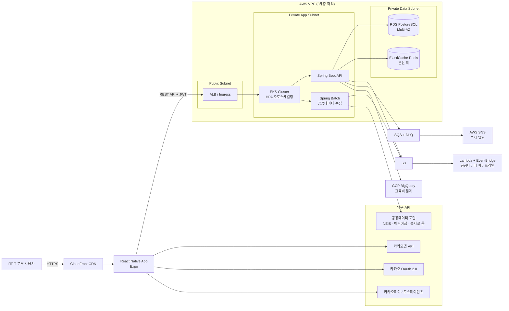

<div align="center">


<br><br>

# 🧸 MoMent (모먼트)

### *Mom + Moment — 아이와 함께하는 모든 순간을 위해*

> 흩어진 교육·돌봄 정보를 통합하여 부모의 선택을 돕는 의사결정 지원 플랫폼

<br>


<br>

**김민지 · 정아름**

</div>

---
 
## 👥 팀원

| 역할 | 이름 | 주요 담당 | GitHub |
|------|------|-----------|--------|
| 팀장 / PM | 정아름 | Frontend · Backend · Infra · CI/CD · Monitoring | [@armddi](https://github.com/armddi) |
| 팀원 | 김민지 | Frontend · Backend · Infra · CI/CD · Monitoring | [@cakefeelsgood](https://github.com/cakefeelsgood) |
 
---
 
## 🎯 프로젝트 목표
 
- 3세~13세 자녀를 둔 부모가 교육·돌봄 서비스를 **한 곳에서** 검색·비교·예약할 수 있도록 한다
- 규칙 기반 추천 엔진으로 자녀 프로필에 맞는 **공공·민간·온라인·정부지원금** 옵션을 제공한다
- 선착순 예약 시스템에 Redis 분산 락 + EKS HPA를 적용하여 **입학 시즌 트래픽 급증**에 대응한다
- 정부 지원금·수당 자격 조건을 자동 매칭하여 **복지 정보 접근성**을 높인다
---
 
## 🏗️ 시스템 아키텍처
 

 
> 📖 상세 아키텍처는 [Wiki — 시스템 아키텍처](../../wiki/10-시스템-아키텍처) 참조
 
---
 
## 🛠️ 기술 스택
 
| 계층 | 기술 |
|------|------|
| **Frontend** | React Native · Expo · 카카오맵 SDK · 카카오 OAuth 2.0 |
| **Backend** | Spring Boot (Java) · JPA · QueryDSL · Spring Security · Spring Batch |
| **Database** | RDS PostgreSQL Multi-AZ · ElastiCache Redis Cluster |
| **Infra** | AWS EKS (HPA) · S3 · Lambda · EventBridge · CloudFront · SQS + DLQ · VPC 3계층 · GCP BigQuery |
| **IaC** | Terraform (S3 Backend + DynamoDB State Lock) |
| **CI/CD** | GitHub Actions · ArgoCD GitOps · ECR |
| **Monitoring** | CloudWatch · Grafana · SNS → Slack · Locust 부하 테스트 |
 
---
 
## ✨ 핵심 기능

### 1️⃣ 자녀 프로필 + 필터 입력
나이/지역/예산/이동거리/온라인 허용 여부/현재 이용 서비스 칩 선택 (자유 입력 없음) + 연령별 체크리스트로 고민을 파악한다.
- 영유아: 언어 / 사회성
- 초등 저학년: 돌봄 / 학습
- 초등 고학년: 자기주도 / 진로

### 2️⃣ 맞춤 추천 엔진 + 지도
규칙 기반 가중치 점수를 계산하여 공공·민간·온라인·정부지원금 카테고리 리스트 뷰와 카카오맵 지도 뷰를 제공한다.
 
```
점수 = 거리×0.30 + 비용×0.25 + 공공우선×0.20 + 연령적합도×0.15 + 신청가능×0.10
```
 
- 핀 색상: 공공=파랑 / 모집중=초록 / 민간=주황 / 마감=회색
- 기관 상세 화면: 운영시간 / 비용 / 사진 / 신청 버튼

### 3️⃣ 선착순 예약·결제 시스템
협업 기관 앱 내 직접 예약·결제 (카카오페이 / 토스페이먼츠, 발표용 테스트 결제 API) + 외부 기관 링크 연결 + 동시 접속 트래픽 처리 (Redis 분산 락 + EKS HPA)

### 4️⃣ 알림
모집 오픈 알림 / 마감 임박 알림 (마감 3일 전 리마인더 포함) / 결제·신청 확정 알림 — AWS SNS 기반

### 5️⃣ 커뮤니티 게시판
지역별·연령별 정보 공유·후기·질문 + 북마크 + 신청 상태 관리 + 후기 별점 → 추천 엔진 점수 자동 반영

### 6️⃣ 정부 지원금 안내
부모 프로필 기반 수급 자격 자동 매칭 → 복지로·지자체 신청 링크 연결 (직접 지급 아님, 자격 확인 + 링크아웃)

---
 
## 🗂️ 연동 데이터 소스
 
| 소스 | 방식 |
|------|------|
| NEIS 학원교습소정보 | Open API 자동 적재 |
| 공공데이터포털 전국학원·교습소 | CSV 초기 적재 + NEIS API 보완 |
| 어린이집정보공개포털 | Open API 자동 적재 |
| 학교알리미 / 유치원알리미 | Open API 자동 적재 |
| 서울 열린데이터광장 | Open API 자동 적재 |
| 복지로 / 정부24 / 아이사랑 | 시드 DB + 링크아웃 |
| 몽땅정보통 (서울시 육아지원) | 시드 DB + 링크아웃 |
| 아이돌봄서비스 / 지역아동센터 | 반자동 시드 + 링크아웃 |
 
---
 
## 🚀 빠른 시작
 
### 사전 요구사항
- Docker / Docker Compose
- Node.js 18+ · Expo CLI
- kubectl · helm
- AWS CLI (EKS 배포 시)
### 로컬 실행
 
```bash
git clone git@github.com:Team-msp-architect-2026/msp-team04.git
cd msp-team04
 
# 환경변수 설정
cp .env.example .env
# .env에서 카카오 OAuth, 카카오맵 API 키 등 입력
 
# 백엔드 + DB + Redis 실행
docker compose up -d
 
# 프론트엔드 (React Native / Expo)
cd frontend
npm install
npx expo start
```
 
### K8s 배포 (ArgoCD GitOps)
 
```bash
# Terraform 인프라 프로비저닝
cd terraform
terraform init
terraform plan
terraform apply
 
# ArgoCD 앱 등록
kubectl apply -f k8s/argocd/application.yaml
```
 
---
 
## 📂 디렉토리 구조
 
```
.
├── .github/
│   ├── workflows/          # GitHub Actions CI/CD
│   └── ISSUE_TEMPLATE/     # Issue / PR 템플릿
├── docs/
│   └── adr/                # Architecture Decision Records
├── terraform/              # IaC (S3 Backend + DynamoDB Lock)
├── k8s/
│   ├── argocd/             # ArgoCD Application 매니페스트
│   └── helm/               # Helm Charts
├── backend/                # Spring Boot API + Spring Batch
├── frontend/               # React Native (Expo)
└── README.md
```
 
---
 
## 📚 문서
 
| 문서 | 위치 |
|------|------|
| 요구사항 정의서 | [Wiki](../../wiki/01-요구사항-정의서) |
| 시스템 아키텍처 | [Wiki](../../wiki/10-시스템-아키텍처) |
| 화면 설계서 | [Wiki](../../wiki/20-화면-설계서) |
| API 명세서 | [Wiki](../../wiki/30-API-명세서) |
| ERD | [Wiki](../../wiki/40-ERD) |
| 인프라 Runbook | [Wiki](../../wiki/50-인프라-Runbook) |
| ADR | [docs/adr/](docs/adr/) |
| 팀 NotebookLM | [링크](https://notebooklm.google.com/notebook/5dcdab83-8832-400b-a348-cd6414795d08) |
 
---
 
## 🔄 CI/CD 파이프라인
 
```
PR 생성
  └─ GitHub Actions: terraform plan + docker build + 테스트
 
main 머지
  └─ GitHub Actions: terraform apply + ECR push
        └─ ArgoCD: EKS 무중단 롤링 배포 (dev → staging → prod)
```
 
---
 
## 📊 모니터링 & 부하 테스트
 
- **CloudWatch + Grafana** 통합 대시보드
- **SNS → Slack** 알림 (장애 / 비용 초과 / 마감 임박)
- **AWS Cost Budget** 알람
- **Locust** 부하 테스트 — 입학 시즌 트래픽 시뮬레이션 + HPA 오토스케일 라이브 데모
---
 
## 🤝 기여 방법
 
[CONTRIBUTING.md](CONTRIBUTING.md) 참조
 
---
 
## 📄 라이선스
 
[MIT](LICENSE)
